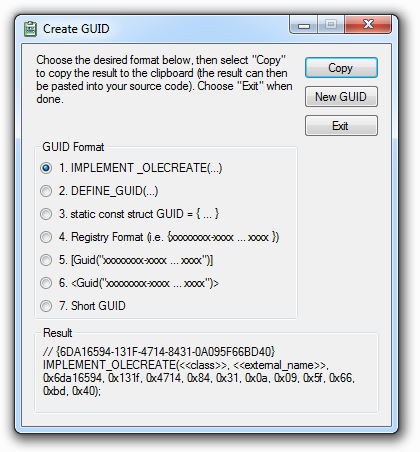

# GUID Generator

This tool is a replacement for the _GUID Generator_ (guidgen.exe) shipped with Visual Studio, and can generate additional GUID formats.

## Additional Formats

### Short GUID
Instead of displaying the GUID as a hexadecimal value, the GUID is ASCII encoded into a smaller string due to the higher data density of ASCII.

The GUID in hexadecimal format:

`c9a646d3-9c61-4cb7-bfcd-ee2522c8f633`

would after encoding be:

`00amyWGct0y_ze4lIsj2Mw`

The code is based on Mads Kristensen's [blog post](http://madskristensen.net/post/a-shorter-and-url-friendly-guid).